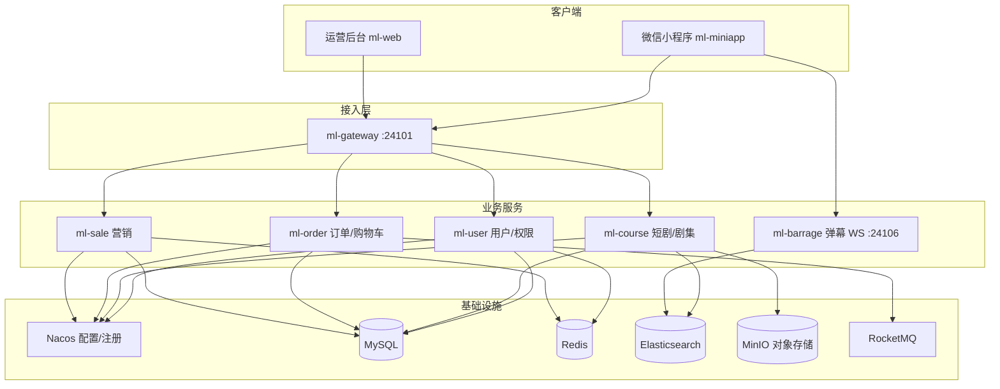

# 绿果付费短剧

> 一套面向短剧行业的 **付费观看 + 运营营销 + 用户增长** 全链路平台，包含微信小程序 C 端、运营管理后台与 Spring Cloud 微服务后端。

绿果付费短剧以「短剧内容分发」为核心，围绕 **选剧、追剧、付费解锁、弹幕互动、营销活动** 等场景构建完整业务闭环。项目采用前后端分离与微服务架构，适用于短剧平台 MVP、毕业设计、技术面试作品展示等场景。

---

## 项目亮点

- **C 端小程序**：首页推荐、短剧分类、剧集播放、购物车、个人中心
- **付费短剧模型**：短剧 / 季 / 集三级结构，支持单剧购买与订单管理
- **实时弹幕**：WebSocket 实时发送 + Elasticsearch 持久化 + 按时间点回放
- **营销能力**：轮播图、公告、文章、秒杀、优惠券
- **运营后台**：RBAC 权限、动态菜单、短剧与用户全生命周期管理
- **微服务架构**：网关统一鉴权，Nacos 配置中心，服务按域拆分

---

## 系统架构



---

## 技术栈

| 层次 | 技术 |
|------|------|
| 后端框架 | Java 17、Spring Boot 3.2、Spring Cloud 2023、Spring Cloud Alibaba |
| 持久层 | MyBatis-Flex、MySQL 8 |
| 注册/配置 | Nacos |
| 缓存/会话 | Redis、Token 网关鉴权 |
| 搜索/弹幕 | Elasticsearch |
| 消息队列 | RocketMQ |
| 对象存储 | MinIO（封面、视频、头像等） |
| 实时通信 | WebSocket（Jakarta WebSocket） |
| 运营后台 | Vue 3、Vite、Element Plus、Axios |
| C 端 | 微信小程序、Vant Weapp |
| 文档/监控 | Knife4j、XXL-JOB（营销定时任务） |

---

## 模块说明

| 模块 | 说明 | 业务映射 |
|------|------|----------|
| `ml-gateway` | API 网关，路由转发、Token 鉴权、白名单 | 统一入口 |
| `ml-user` | 用户、角色、菜单、登录鉴权 | 用户中心 / RBAC |
| `ml-course` | 分类、短剧、季、集、评论、举报、关注 | 短剧内容域 |
| `ml-order` | 购物车、订单、订单明细、支付对接 | 付费交易域 |
| `ml-sale` | 公告、轮播、文章、秒杀、优惠券 | 营销增长域 |
| `ml-barrage` | 弹幕 WebSocket 服务，异步写入 ES | 互动弹幕 |
| `ml-common` | 公共实体、工具类、统一返回、异常处理 | 基础组件 |
| `ml-web` | 运营管理后台 | B 端 |
| `ml-miniapp` | 微信小程序 | C 端 |
| `ml-generator` | 代码生成器 | 开发辅助 |

---

## 核心业务说明

### 短剧内容模型

```
分类 (category)
  └── 短剧 (course)          ← 一部完整短剧，含封面、价格、简介
        └── 季 (season)      ← 可选分组，如「第一季」
              └── 集 (episode) ← 单集视频，对应 MinIO 中的剧集文件
```

C 端用户通过小程序浏览短剧列表，进入详情页播放视频，支持发送弹幕、加入购物车、下单购买。

### 付费与订单

- 用户将短剧加入购物车，生成订单
- 订单服务负责订单状态、明细与支付流程对接（支付宝 SDK 等）
- 网关层统一校验登录 Token，保障接口安全

### 弹幕互动

1. 用户在播放页通过 WebSocket 发送弹幕
2. `ml-barrage` 广播给在线用户，并异步写入 Elasticsearch（`ml-barrage` 索引）
3. 再次进入短剧时，按课程维度拉取历史弹幕，按视频时间点展示
4. 支持同一短剧下多集次、历史 `courseId` 维度的弹幕聚合查询

### 营销体系

- **首页运营**：轮播图、公告、推荐文章
- **活动转化**：限时秒杀、优惠券发放
- **Redis 缓存**：热点短剧信息、秒杀库存等

---

## 数据库设计

项目按业务域拆分为四个 MySQL 库：

| 库名 | 含义 | 主要表 |
|------|------|--------|
| `ml_cms` | 内容管理 Content | course、season、episode、category、comment、report、follow |
| `ml_ums` | 用户管理 User | user、role、menu、user_role、role_menu |
| `ml_oms` | 订单管理 Order | order、order_detail、cart |
| `ml_sms` | 营销管理 Sales | banner、notice、article、seckill、seckill_detail、coupons |

---

## 目录结构

```
绿果付费短剧/
├── ml-gateway/          # API 网关
├── ml-user/             # 用户服务
├── ml-course/           # 短剧内容服务
├── ml-order/            # 订单服务
├── ml-sale/             # 营销服务
├── ml-barrage/          # 弹幕 WebSocket 服务
├── ml-common/           # 公共模块
├── ml-generator/        # 代码生成
├── ml-web/              # 运营后台（Vue3）
├── ml-miniapp/          # 微信小程序
└── document/            # 部署与运维文档
```

---

## 环境要求

- JDK 17+
- Maven 3.8+
- Node.js 18+（前端）
- MySQL 8.0+
- Redis
- Nacos 2.x
- Elasticsearch 8.x
- MinIO
- RocketMQ（订单/秒杀等场景）
- 微信开发者工具（小程序调试）

---

## 快速开始

### 1. 基础设施

确保以下中间件已启动，并在 Nacos 中配置 `common-config.yaml`（数据库、Redis、白名单等）：

- Nacos：`8848`
- MySQL：创建 `ml_cms`、`ml_ums`、`ml_oms`、`ml_sms` 四个库并导入表结构
- Redis
- Elasticsearch：`9200`
- MinIO：`9000`，Bucket 建议命名为 `my-lesson`

### 2. 启动后端服务

按依赖顺序启动（或使用 IDE 多模块运行）：

```bash
# 网关
ml-gateway    # 默认 24101

# 业务服务（需注册到 Nacos）
ml-user
ml-course
ml-order
ml-sale
ml-barrage    # 默认 24106（WebSocket）
```

### 3. 启动运营后台

```bash
cd ml-web
npm install
npm run dev
```

配置 `.env.local`：

```env
VITE_API_BASE_URL=http://localhost:24101
VITE_API_PROXY=http://localhost:24101
```

### 4. 启动微信小程序

1. 使用微信开发者工具导入 `ml-miniapp` 目录
2. 修改 `utils/const.js` 中的 `HOST`、`LINUX_HOST` 为实际网关与 MinIO 地址
3. 编译运行

---

## 主要端口

| 服务 | 端口 | 说明 |
|------|------|------|
| ml-gateway | 24101 | HTTP 网关 |
| ml-barrage | 24106 | WebSocket 弹幕 |
| Nacos | 8848 | 配置 / 注册中心 |
| Elasticsearch | 9200 | 弹幕 / 搜索 |
| MinIO | 9000 | 静态资源 |

---

## 功能清单

### C 端小程序

- [x] 账号 / 手机号登录、注册
- [x] 首页轮播与推荐
- [x] 短剧分类与搜索
- [x] 短剧详情、视频播放
- [x] 弹幕发送与历史回放
- [x] 购物车、个人中心
- [x] 订单列表、资料编辑

### 运营后台

- [x] 管理员登录、RBAC 权限
- [x] 用户 / 角色 / 菜单管理
- [x] 短剧分类、短剧、季、集 CRUD
- [x] 评论、举报、关注管理
- [x] 轮播图、公告、文章、秒杀、优惠券
- [x] 订单与订单明细管理

---

## 部署说明

- RocketMQ 容器化部署见：[document/rocketmq-容器部署.md](document/rocketmq-容器部署.md)
- **秒杀高并发方案**（Redis Lua、用户防重、限流）：[docs/seckill-concurrency.md](docs/seckill-concurrency.md)
- 生产环境建议：Gateway + 各微服务独立部署，MinIO / ES / Redis 集群化，Nginx 反向代理与 HTTPS

---

## 项目展示建议（简历 / 面试）

可重点描述：

1. **微服务拆分思路**：按用户、内容、交易、营销、弹幕五域划分，网关统一鉴权
2. **短剧付费闭环**：内容建模 → 购物车 → 订单 → 支付
3. **弹幕方案**：WebSocket 实时 + ES 持久化 + 小程序自定义弹幕层按时间点渲染
4. **营销系统**：秒杀 + Redis Lua 原子扣库存 + RocketMQ 异步下单（详见 [docs/seckill-concurrency.md](docs/seckill-concurrency.md)）
5. **对象存储**：MinIO 管理封面、剧集视频等资源

---

## 开源协议

本项目仅供学习与交流使用。如需商用，请自行完善支付合规、内容版权与用户隐私等法律要求。

---

## 联系方式

如有问题或合作意向，欢迎通过 Issue 或 Pull Request 交流。
