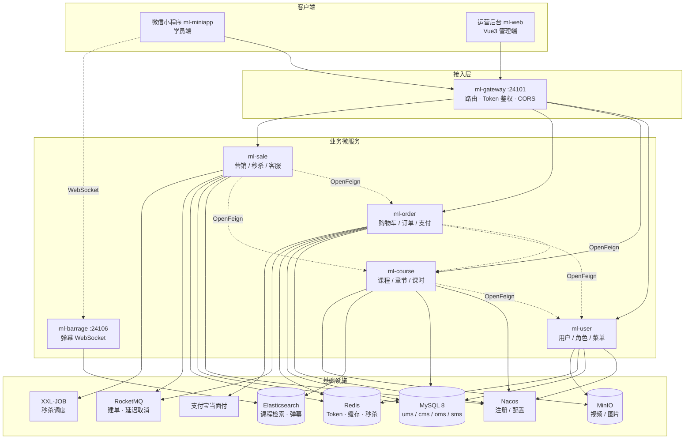

# 知堂 · 线上网课平台

<p>
  
  
  
  
  
  
</p>

> **知堂**是一套面向在线教育场景的**网课售卖与学习平台**，覆盖「选课 → 下单 → 支付 → 学习 → 互动」完整链路，包含微信小程序（学员端）、Vue3 运营后台（管理端）与 Spring Cloud 微服务后端。

项目以**付费课程**为核心业务载体，重点打磨了三块工程能力：**秒杀抢课的高并发链路**（Redis Lua 原子扣减 + RocketMQ 异步建单 + 失败补偿）、**支付闭环**（支付宝当面付 + 延迟消息超时取消 + 幂等防重）、**课堂实时互动**（WebSocket 弹幕 + Elasticsearch 持久化回放）。适用于微服务实践学习、毕业设计与技术面试作品展示。

> 💡 仓库中模块以 `ml-` 前缀命名，来源于项目代号 **my-lesson**（我的课堂），与业务名「知堂」对应。

---

## 目录

- [核心特性](#核心特性)
- [系统架构](#系统架构)
- [技术栈](#技术栈)
- [模块说明](#模块说明)
- [核心业务与技术方案](#核心业务与技术方案)
- [数据库设计](#数据库设计)
- [快速开始](#快速开始)
- [接口约定与端口](#接口约定与端口)
- [测试与压测](#测试与压测)
- [目录结构](#目录结构)
- [功能清单](#功能清单)
- [Roadmap 与已知不足](#roadmap-与已知不足)
- [说明与许可](#说明与许可)

---

## 核心特性

| 能力 | 说明 |
|------|------|
| 🎓 **三级课程模型** | 课程 → 章节 → 课时，课时对应 MinIO 中的视频文件，支持在线播放 |
| 💳 **付费学习闭环** | 购物车 / 立即购买 → 预支付 → 支付宝扫码 → 支付回调 → 「我的课程」解锁 |
| ⚡ **秒杀抢课** | Redis Lua 原子扣库存、用户占位幂等、秒级限流、MQ 异步建单、失败自动补偿回滚 |
| ⏱ **订单超时自动取消** | RocketMQ 延迟消息驱动，取消后回滚秒杀库存与用户占位 |
| 💬 **课堂弹幕** | WebSocket 实时广播 + 异步写入 Elasticsearch，重进课堂按视频时间点回放 |
| 🔍 **课程检索** | Elasticsearch 按课程标题 / 讲师（`author`）分页搜索 |
| 🔐 **网关统一鉴权 + RBAC** | 网关 Token 校验与滑动续期，后台动态菜单与按钮级权限 |
| 📢 **运营与营销** | 轮播图、公告、文章、优惠券、整点秒杀（XXL-JOB 定时开关与预热） |
| 🤖 **自助客服** | FAQ 关键词匹配 + Feign 拉取当前用户订单上下文，答复带订单状态 |
| 🧱 **工程化基建** | Nacos 配置中心、OpenFeign + 降级 fallback、Sentinel、Knife4j 文档、Micrometer + Zipkin 链路追踪、MyBatis-Flex 代码生成 |

---

## 系统架构


```mermaid
flowchart TB
    subgraph client [客户端]
        MP["微信小程序 ml-miniapp<br/>学员端"]
        WEB["运营后台 ml-web<br/>Vue3 管理端"]
    end

    subgraph gateway [接入层]
        GW["ml-gateway :24101<br/>路由 · Token 鉴权 · CORS"]
    end

    subgraph services [业务微服务]
        USER["ml-user<br/>用户 / 角色 / 菜单"]
        COURSE["ml-course<br/>课程 / 章节 / 课时"]
        ORDER["ml-order<br/>购物车 / 订单 / 支付"]
        SALE["ml-sale<br/>营销 / 秒杀 / 客服"]
        BARRAGE["ml-barrage :24106<br/>弹幕 WebSocket"]
    end

    subgraph infra [基础设施]
        NACOS["Nacos<br/>注册 / 配置"]
        MYSQL[("MySQL 8<br/>ums / cms / oms / sms")]
        REDIS[("Redis<br/>Token · 缓存 · 秒杀")]
        ES[("Elasticsearch<br/>课程检索 · 弹幕")]
        MINIO[("MinIO<br/>视频 / 图片")]
        MQ["RocketMQ<br/>建单 · 延迟取消"]
        XXL["XXL-JOB<br/>秒杀调度"]
        ALIPAY["支付宝当面付"]
    end

    MP --> GW
    WEB --> GW
    MP -. WebSocket .-> BARRAGE
    GW --> USER & COURSE & ORDER & SALE
    ORDER -. OpenFeign .-> COURSE & USER
    COURSE -. OpenFeign .-> USER
    SALE -. OpenFeign .-> ORDER & COURSE
    USER & COURSE & ORDER & SALE --> NACOS
    USER --> MYSQL & REDIS & MINIO
    COURSE --> MYSQL & ES & MINIO
    ORDER --> MYSQL & REDIS & MQ & ALIPAY
    SALE --> MYSQL & REDIS & MQ & XXL
    BARRAGE --> ES
```

**请求链路**：客户端携带 `token` 请求头 → 网关校验白名单 / Redis 中的 Token 并续期 → 按服务前缀路由到对应微服务 → 服务内通过 `TokenUserResolver` 从 Redis 反解真实 `userId`（不信任客户端传入的用户标识）。

---

## 技术栈

| 层次 | 选型 |
|------|------|
| 语言 / 框架 | Java 17、Spring Boot 3.2.5、Spring Cloud 2023.0.1、Spring Cloud Alibaba 2023.0.1.0 |
| 持久层 | MyBatis-Flex 1.10（APT 生成 TableDef，QueryChain 链式查询）、MySQL 8、HikariCP |
| 注册 / 配置 | Nacos（Discovery + Config，`shared-configs` 共享配置） |
| 服务调用 | OpenFeign + LoadBalancer + fallback 降级、Sentinel |
| 缓存 / 会话 | Redis（Token 会话、热点数据、秒杀库存与限流，Lua 脚本原子操作） |
| 消息队列 | RocketMQ 5.2（异步建单、延迟消息超时取消） |
| 搜索引擎 | Elasticsearch 8（课程检索、弹幕存储与回放） |
| 对象存储 | MinIO（课程封面、摘要图、课时视频、头像、轮播图） |
| 实时通信 | Jakarta WebSocket（`@ServerEndpoint`） |
| 定时任务 | XXL-JOB（秒杀预热与整点开关） |
| 支付 | 支付宝 easysdk 当面付（precreate 预下单 + 回调验签 + 主动查单），Hutool 生成二维码 |
| 可观测性 | Spring Boot Actuator、Micrometer Tracing + Brave、Zipkin |
| 接口文档 | Knife4j 4.4（OpenAPI 3） |
| 管理端 | Vue 3.4、Vite 5、Element Plus 2.7、Vue Router 4、Vuex 4、ECharts 5、Axios |
| 学员端 | 微信小程序（glass-easel）、Vant Weapp、自定义 TabBar |
| 工具库 | Hutool 5.8、Hibernate Validator 8、EasyExcel 3.3（已封装 `EasyExcelUtil`，导出接口待接入） |

---

## 模块说明

| 模块 | 规模 | 职责 |
|------|------|------|
| `ml-gateway` | 3 类 | API 网关：路由转发、全局 Token 过滤器、白名单放行、CORS |
| `ml-user` | 40 类 | 用户注册登录（账号 / 手机验证码）、角色、菜单、用户角色与角色菜单关联、头像上传 |
| `ml-course` | 62 类 | 课程分类、课程、章节、课时、评论、举报、关注，ES 课程检索 |
| `ml-order` | 34 类 | 购物车、订单与订单明细、预支付与支付宝对接、MQ 建单与超时取消、我的课程 |
| `ml-sale` | 59 类 | 轮播图、公告、文章、优惠券、秒杀活动与明细、自助客服、XXL-JOB 任务 |
| `ml-barrage` | 6 类 | 弹幕 WebSocket 服务，广播在线消息并异步落 ES |
| `ml-common` | 64 类 | 公共实体与 TableDef、统一返回 `Result` / `ResultCode`、全局异常、Redis / MinIO / Excel 工具、常量 `ML`、秒杀 Key 规范与补偿组件 |
| `ml-generator` | 5 类 | MyBatis-Flex 代码生成器（实体、Mapper、Service、Controller 模板） |
| `ml-web` | 27 文件 | 运营后台：登录注册、动态路由与菜单、通用 CRUD 视图、数据看板 |
| `ml-miniapp` | 22 页面 | 学员端小程序：首页 / 课程 / 购物车 / 我的 四大 Tab |

---

## 核心业务与技术方案

### 1. 课程内容模型

```
分类 category
  └── 课程 course          ← 标题、讲师、价格、封面、摘要图、简介
        └── 章节 season    ← 课程分组，如「第一章 入门」
              └── 课时 episode  ← 单节视频，对应 MinIO 中的视频与封面
```

- 课程封面 / 摘要图、课时视频与视频封面统一托管在 MinIO，桶名 `my-lesson`，按 `course-cover`、`course-summary`、`episode-video`、`episode-video-cover`、`avatar`、`banner` 分目录存放。
- 每类资源均有默认占位文件（如 `default-course-cover.jpg`），避免空图。

### 2. 网关鉴权与 RBAC

- **网关侧**（`TokenGlobalFilter`）：白名单（Nacos 中 `token.white_list`，支持动态刷新）直接放行；否则取请求头 `token` 到 Redis 校验，命中后**滑动续期 30 分钟**，失效返回 `6000 登录过期`。
- **服务侧**（`TokenUserResolver`）：从 Redis 中的 Token 快照解析真实用户，敏感接口（下单、秒杀）**一律不信任请求体中的 `fkUserId` 与价格**。
- **后台权限**：`user → user_role → role → role_menu → menu` 五表 RBAC，登录后按角色下发菜单树，前端 `router/dynamic.js` 动态注册路由，`utils/permissions.js` 控制按钮级权限，越权跳转 `Forbidden`。

### 3. 交易与支付

```
加入购物车 / 立即购买
    ↓ POST /order/prePay              创建未付款订单（校验重复购买）
    ↓ POST /order/getQrCode           支付宝 precreate → Hutool 生成二维码流
    ↓ 用户扫码支付
    ↓ 支付宝异步通知 → verifyNotify 验签 → 订单置为已付款
    ↓ 兜底：AlipayTradeQuery 主动查单
    ↓ 「我的 → 我的课程」按订单明细解锁学习
```

- **重复购买拦截**：下单前用订单明细反查该用户已购课程，命中抛 `4009 / 您已购买该课程`。
- **超时取消**：下单同时投递 RocketMQ 延迟消息（topic `ml-topic`），到期由 `OrderTimeoutListener` 取消未付款订单，并回滚秒杀库存、删除用户占位 Key。
- **订单状态**：`0 未付款 / 1 已付款 / 2 已取消 / 3 其他`；支付方式 `0 未支付 / 1 微信 / 2 支付宝 / 3 其他`（当前实现支付宝）。

### 4. 秒杀高并发（本项目重点）

早期实现是「全局 Redisson 锁 + `get`/`incr` 非原子扣减」，全活动串行、可重复下单、价格可被篡改。现版本改造为无锁原子链路：

```
小程序（本地节流 1.5s + 随机错峰 ≤400ms）
    │
    ▼  POST /seckill/kill  { fkSeckillId, fkCourseId }   ← 仅传标识，不传用户与价格
ml-gateway（Token 校验）
    │
    ▼ ml-sale SeckillServiceImpl
    ├─ TokenUserResolver        Redis 反解真实 userId
    ├─ 用户秒级限流             INCR + 2s TTL，默认 10 次/秒
    ├─ 活动状态缓存             seckill:status:{id}，5s 短 TTL 挡状态翻转瞬间的查库风暴
    ├─ 商品明细缓存             seckill:detail:{id}:{courseId}，价格以库为准
    ├─ Lua 原子脚本             判占位 → 判库存 → DECR + SET 占位（一次往返）
    ├─ 预支付快照               seckill:prepay:{sn}，二维码可与 MQ 建单并行拉取
    └─ RocketMQ 异步建单        失败即 rollbackKill 补偿回滚
            │
            ▼ ml-order OrderMessageListener
            └─ createSeckillOrder：sn 幂等 + 待付款防重 + 已支付待落库标记
```

**Lua 脚本返回值语义**：`1` 扣减成功 / `0` 用户已占位（幂等直接返回原订单号） / `-1` 库存不足。

**Redis Key 规范**（`com.mdkj.util.SeckillRedisKeys`）：

| 用途 | Key | 说明 |
|------|-----|------|
| 库存 | `seckill:stock:{seckillId}:{courseId}` | 活动维度隔离，多活动互不影响，缓存 12h |
| 用户占位 | `seckill:user:{seckillId}:{courseId}:{userId}` | 值为订单号 `sn`，TTL 960s（> 订单超时） |
| 用户限流 | `seckill:rate:{userId}:{epochSecond}` | 每秒请求计数 |
| 活动状态 | `seckill:status:{seckillId}` | 5s 短 TTL，自愈 |
| 商品明细 | `seckill:detail:{seckillId}:{courseId}` | 标题 / 封面 / 原价 / 秒杀价 |
| 预支付快照 | `seckill:prepay:{sn}` | 拉码不依赖订单已落库 |
| 已支付待落库 | `seckill:paid:{sn}` | 兼容支付回调早于 MQ 建单 |

**定时调度**（`ml-sale/job/SeckillJob`，XXL-JOB）：`initSeckill` 每日预热库存与商品明细缓存；`startMorningSeckill` / `stopMorningSeckill`、`startNoonSeckill` / `stopNoonSeckill`、`startAfterNoonSeckill` / `stopAfterNoonSeckill` 控制早、中、下午三场整点活动的开始与结束。

**错误码**：`7000` 活动未开始、`7001` 活动已结束、`7002` 库存不足、`7003` 操作过于频繁（前端命中后额外冷却 3s）。

> 完整方案与变更清单见 [docs/seckill-concurrency.md](docs/seckill-concurrency.md)。

### 5. 课堂弹幕互动

1. 学员在课时播放页通过 WebSocket 连接 `ws://{host}:24106/api/v1/barrage/{userId}`；
2. `ml-barrage` 向在线连接广播弹幕，并异步写入 Elasticsearch 索引 `ml-barrage`；
3. 再次进入课堂时按课程维度拉取历史弹幕，小程序自定义弹幕层按视频播放时间点渲染；
4. 支持同一课程下多课时、历史 `courseId` 维度的弹幕聚合查询（解决换课时 / 重新登录后历史弹幕丢失问题）。

### 6. 检索与对象存储

- `ml-course` 维护 `CourseDoc`，`GET /course/search` 按课程标题或讲师（`author`）分页检索，无关键词时走 `findAll` 排序返回。
- MinIO 承载全部富媒体资源，`MinioUtil` 统一封装上传与访问路径拼接；小程序侧在 `utils/const.js` 中集中配置各资源目录前缀。

### 7. 运营与营销

- **首页运营位**：轮播图、公告、推荐文章，均带 Redis 前 N 条缓存（`top_banner:` / `top_notice:` / `top_article:`）。
- **优惠券**：兑换口令领取，购物车结算时抵扣。
- **数据看板**：用户与订单统计数据缓存于 Redis（`user_statistics_data`、`order_statistics_data`），后台以 ECharts 呈现。
- **自助客服**：内置 6 条 FAQ，`CustomerServiceImpl` 先做 FAQ 匹配、再做关键词分支（购买 / 支付 / 退款 / 优惠券 / 秒杀等），并通过 Feign 调 `ml-order` 拼接当前用户的订单上下文，让答复带上真实订单状态。

---

## 数据库设计

按业务域拆分为四个 MySQL 库：

| 库名 | 含义 | 主要表 |
|------|------|--------|
| `ml_ums` | 用户管理 User | `user`、`role`、`menu`、`user_role`、`role_menu` |
| `ml_cms` | 内容管理 Content | `course`、`season`、`episode`、`category`、`comment`、`report`、`follow` |
| `ml_oms` | 订单管理 Order | `order`、`order_detail`、`cart` |
| `ml_sms` | 营销管理 Sales | `banner`、`notice`、`article`、`seckill`、`seckill_detail`、`coupons` |

实体定义位于 `ml-common/src/main/java/com/mdkj/entity/`，字段与注解（`@Table`、`@Id`）即为表结构的权威描述；`entity/table/` 下的 `*TableDef` 由 MyBatis-Flex APT 生成，用于类型安全的链式查询。

> ⚠️ 仓库暂未包含建表 SQL，请参照实体类建库建表，或使用 `ml-generator` 反向生成代码。补充 `docs/sql/` 初始化脚本已列入 [Roadmap](#roadmap-与已知不足)。

---

## 快速开始

### 环境要求

| 依赖 | 版本 | 说明 |
|------|------|------|
| JDK | 17+ | 必需 |
| Maven | 3.8+ | 必需 |
| Node.js | 18+ | 运营后台 / 压测脚本 |
| MySQL | 8.0+ | 四个业务库 |
| Redis | 6+ | Token、缓存、秒杀 |
| Nacos | 2.x | 注册 + 配置中心 |
| Elasticsearch | 8.x | 课程检索、弹幕 |
| MinIO | 最新 | 桶名 `my-lesson` |
| RocketMQ | 5.x | 订单与秒杀链路 |
| XXL-JOB | 2.4.x | 秒杀定时任务（可选） |
| 微信开发者工具 | 最新 | 小程序调试 |

### 1. 启动中间件

RocketMQ 可直接使用仓库提供的编排文件（Broker 配置见 `docker/rocketmq/broker.conf`）：

```bash
docker compose -f docker-compose.rocketmq.yml up -d
```

其余中间件按常规方式部署，详见 [document/rocketmq-容器部署.md](document/rocketmq-容器部署.md)。

### 2. 配置 Nacos

各服务的 `bootstrap.yaml` 只声明了 Nacos 地址与分组，**业务配置全部集中在配置中心**：

- 分组：`ml-group`
- 共享配置：`common-config.yaml`（数据源、Redis、ES、MinIO、RocketMQ、Token 白名单等）
- 各服务私有配置：`${spring.application.name}-${profile}.yaml`，如 `ml-sale-dev.yaml`

`common-config.yaml` 参考骨架（请替换为自己的地址与凭据）：

```yaml
spring:
  data:
    redis:
      host: 127.0.0.1
      port: 6379
    elasticsearch:
      uris: http://127.0.0.1:9200
  datasource:
    driver-class-name: com.mysql.cj.jdbc.Driver
    # 各服务在自己的配置文件中覆盖 url，分别指向 ml_ums / ml_cms / ml_oms / ml_sms
    username: root
    password: your_password

rocketmq:
  name-server: 127.0.0.1:9876
  producer:
    group: ml-group

minio:
  endpoint: http://127.0.0.1:9000
  access-key: your_access_key
  secret-key: your_secret_key

token:
  # 无需登录即可访问的接口（登录、注册、验证码、首页运营位、支付回调等）
  white_list:
    - /user-server/api/v1/user/login
    - /user-server/api/v1/user/register
    - /order-server/api/v1/order/prePayNotify
```

网关路由需在 Nacos 中为 `ml-gateway` 配置，路径前缀与客户端约定保持一致（见[接口约定](#接口约定与端口)）：

```yaml
spring:
  cloud:
    gateway:
      discovery:
        locator:
          enabled: false
      routes:
        - id: user-server
          uri: lb://ml-user
          predicates:
            - Path=/user-server/**
          filters:
            - StripPrefix=1
        # course-server → ml-course，order-server → ml-order，sale-server → ml-sale 同理
```

> 支付宝当面付需另行配置 appId、应用私钥与支付宝公钥（见 `ml-order` 的 `AlipayUtil`），本地调试建议使用沙箱环境。

### 3. 编译并启动后端

```bash
# 根目录编译全部模块
mvn -DskipTests clean install

# 按顺序启动（IDE 多模块运行同理）
ml-gateway    # 24101，HTTP 入口
ml-user
ml-course
ml-order
ml-sale
ml-barrage    # 24106，WebSocket
```

各服务接口文档：`http://{服务地址}/doc.html`（Knife4j）。

### 4. 启动运营后台

```bash
cd ml-web
npm install
npm run dev
```

`ml-web/.env.local`：

```env
VITE_API_BASE_URL=http://localhost:24101
VITE_API_PROXY=http://localhost:24101
```

### 5. 运行学员端小程序

1. 用微信开发者工具导入 `ml-miniapp` 目录；
2. 修改 `ml-miniapp/utils/const.js` 中的 `HOST` / `LINUX_HOST` 为实际网关与 MinIO 地址（同时决定 `GATEWAY_HOST`、`SOCKET_SERVER`、`MINIO_HOST`）；
3. 构建 npm（`工具 → 构建 npm`，Vant Weapp 依赖），勾选「不校验合法域名」；
4. 编译预览。

---

## 接口约定与端口

**统一路径格式**：`/{服务前缀}/api/v1/{模块}/{动作}`

| 服务前缀 | 目标服务 | 模块 |
|----------|----------|------|
| `user-server` | ml-user | `user`、`role`、`menu`、`userRole`、`roleMenu` |
| `course-server` | ml-course | `course`、`category`、`season`、`episode`、`comment`、`report`、`follow` |
| `order-server` | ml-order | `order`、`orderDetail`、`cart` |
| `sale-server` | ml-sale | `banner`、`notice`、`article`、`coupons`、`seckill`、`seckillDetail`、`customerService` |

**统一响应体**（`ml-common` 中 `Result` + `ResultAdvice` 自动包装）：

```json
{ "code": 1000, "message": "操作成功", "data": {} }
```

常用状态码：`1000` 成功、`4xxx` 业务冲突（重复数据等）、`5xxx` 资源不存在、`6000` 登录过期 / 远程调用失败、`7000~7003` 秒杀专用码。

**端口一览**：

| 服务 | 端口 | 说明 |
|------|------|------|
| ml-gateway | 24101 | HTTP 统一入口 |
| ml-barrage | 24106 | WebSocket 弹幕 |
| Nacos | 8848 | 注册 / 配置中心 |
| MySQL | 3306 | 四个业务库 |
| Redis | 6379 | 会话与缓存 |
| Elasticsearch | 9200 | 检索与弹幕 |
| MinIO | 9000 | 对象存储 |
| RocketMQ NameServer | 9876 | 消息队列 |

---

## 测试与压测

**单元测试**

```bash
mvn test
```

当前覆盖秒杀链路的关键补偿与消费逻辑：

- `ml-common` → `SeckillStockCompensatorTest`：库存回滚的归属校验（只回滚自己占位的那一单）
- `ml-order` → `OrderMessageListenerTest`：MQ 建单的幂等与防重

**秒杀压测**（`scripts/seckill-loadtest/`，Node ESM 脚本 + JMeter 方案）

```bash
cd scripts/seckill-loadtest
npm install
cp config.example.json config.json   # 填写网关地址、账号池、活动与课程 ID
node loadtest-1000.mjs               # 1000 并发；另有 config-10000.json 场景
node compare-reports.mjs             # 对比多轮压测报告
```

脚本会直连 Redis 校验 `seckill:stock:{seckillId}:{courseId}` 的最终库存与订单数是否一致。压测前可调用 `POST /seckill/prepareLoadTest?seckillId=&stock=` 重置库存并清理该活动的用户占位。详见 [scripts/seckill-loadtest/README.md](scripts/seckill-loadtest/README.md)。

---

## 目录结构

```
知堂 my-lesson/
├── ml-gateway/               # API 网关（路由、Token 过滤、CORS）
├── ml-user/                  # 用户 / 角色 / 菜单服务
├── ml-course/                # 课程内容服务（含 ES 检索）
├── ml-order/                 # 订单与支付服务（含 MQ 消费）
├── ml-sale/                  # 营销 / 秒杀 / 客服服务（含 XXL-JOB）
├── ml-barrage/               # 弹幕 WebSocket 服务
├── ml-common/                # 公共实体、工具、统一返回、秒杀 Key 与补偿
├── ml-generator/             # MyBatis-Flex 代码生成器
├── ml-web/                   # 运营后台（Vue3 + Vite）
├── ml-miniapp/               # 学员端小程序
├── docs/
│   └── seckill-concurrency.md    # 秒杀高并发方案
├── document/                 # 部署与运维文档
├── docker/                   # RocketMQ Broker 配置
├── scripts/
│   ├── seckill-loadtest/     # 秒杀压测（Node + JMeter）
│   └── run-all.ps1           # 一键启动脚本
├── docker-compose.rocketmq.yml
└── pom.xml                   # 聚合 POM，统一依赖版本
```

---

## 功能清单

### 学员端小程序

- [x] 账号登录、手机验证码登录、注册
- [x] 首页轮播、公告、推荐文章、整点秒杀
- [x] 课程分类浏览与关键词搜索
- [x] 课程详情、章节课时列表、视频播放
- [x] 弹幕发送与历史回放
- [x] 购物车、优惠券口令兑换、结算下单
- [x] 支付宝扫码支付、继续支付、订单列表
- [x] 我的课程（已购课程学习入口）
- [x] 关注列表、资料编辑（昵称 / 性别 / 年龄 / 星座 / 省份 / 邮箱 / 头像）、修改密码
- [x] 自助客服问答

### 运营后台

- [x] 管理员登录注册、RBAC 权限与动态菜单
- [x] 用户 / 角色 / 菜单及关联关系管理
- [x] 课程分类、课程、章节、课时 CRUD 与资源上传
- [x] 评论、举报、关注管理
- [x] 轮播图、公告、文章、优惠券管理
- [x] 秒杀活动与活动商品明细管理
- [x] 订单与订单明细管理、数据看板

---

## Roadmap 与已知不足

坦诚列出当前状态，也是后续迭代方向：

- [ ] **补充建表 SQL**：仓库暂无 `docs/sql/` 初始化脚本，克隆后需依据实体类自行建库建表。
- [ ] **测试覆盖**：目前仅 2 个单测集中在秒杀链路，Service 层整体缺少测试。
- [ ] **服务侧鉴权加固**：鉴权集中在网关，微服务端口若直接暴露可被绕过，生产环境需网络隔离或服务间调用签名。
- [ ] **配置外部化**：`bootstrap.yaml` 与小程序 `const.js` 中的地址仍为开发环境硬编码，建议改为环境变量 / 多环境配置。
- [ ] **网关限流**：接入 Sentinel 全局流控规则（依赖已引入，规则尚未配置）。
- [ ] **秒杀排队页**：令牌桶下发 `killToken`，进一步削峰。
- [ ] **支付成功后清理**：支付完成即删除秒杀用户占位 Key（当前依赖 TTL 自然过期）。
- [ ] **自助客服升级**：现为关键词规则匹配，可接入大模型做语义理解与多轮对话。
- [ ] **微信支付**：常量已预留 `WECHAT_PAY`，尚未接入。

---

## 说明与许可

本项目仅供学习与技术交流使用。若用于商业场景，请自行完善支付合规、内容版权、用户隐私与数据安全等法律要求，并移除示例配置中的默认密码与测试凭据。

欢迎通过 Issue / Pull Request 交流改进建议。如果这个项目对你有帮助，欢迎点个 ⭐️。
